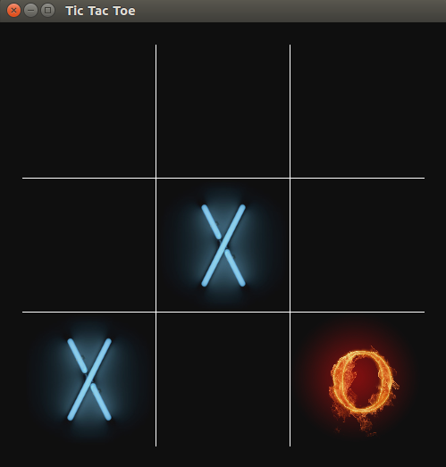

# Tic-Tac-Toe
A Tic Tac Toe game using OpenGL.  
  
## Dependencies ##
1. OpenGL  
2. Glut  
3. SOIL (Download it from [here](http://www.lonesock.net/soil.html))
  
## How to run ##
In linux, simply type make.  

## Play against computer ##
Default mode is two players. Run with --single argument to play against computer.  
  
## Snapshots ##

